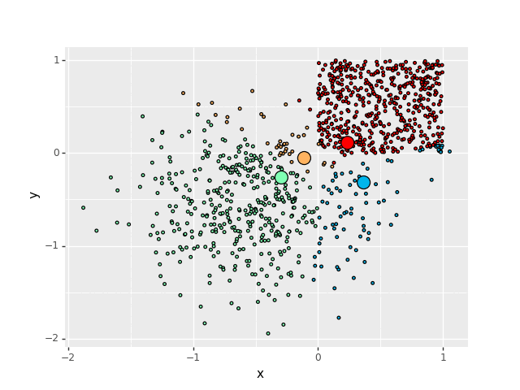

**Simple 2D k-means clustering implementation**

Simple k-means clustering implementation using naive gradient descent, implemented in pytorch. Generates a nice animation, weeee.

Contents are inside the notebook, including a demonstration how k-means clustering can be used to compress images.

